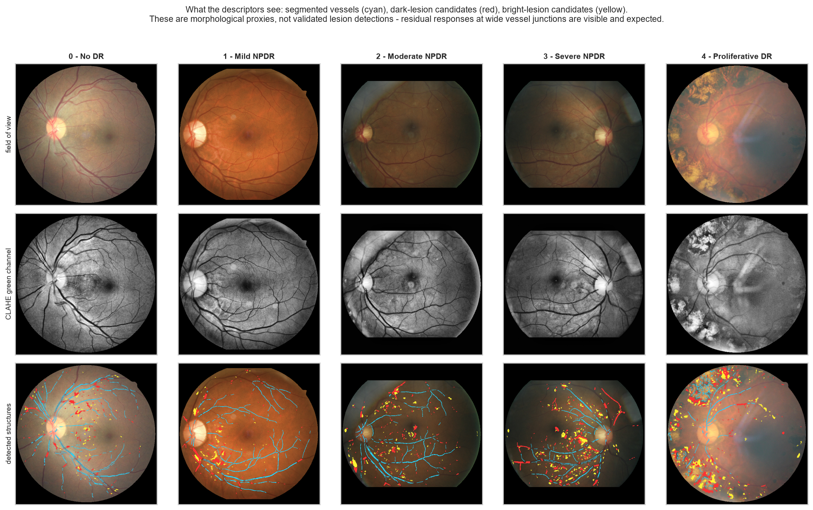
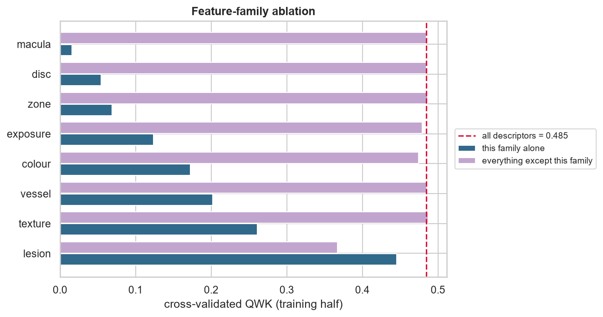

# Retinal biomarkers → diabetic-retinopathy grade

[](https://github.com/Abunaidan/diabetic-retinopathy-grading/actions/workflows/ci.yml)
[](pyproject.toml)
[](LICENSE)

An end-to-end, reproducible machine-learning pipeline that grades diabetic
retinopathy (0–4) from a single colour fundus photograph using **~145 handcrafted
retinal biomarkers** and an **ordinal** classifier — with the evaluation protocol a
medical-imaging result actually needs: patient-level splitting, quadratic weighted
kappa, nested cross-validation, bootstrap confidence intervals, a measured leakage
audit, and a clinically framed referral operating point.

No GPU. No pretrained weights. No downloads required to run it: the repository
renders its own synthetic cohort so `python -m dr all` works on a clean checkout.

```bash
pip install -r requirements.txt && pip install -e .
python -m dr all          # synthesise → join labels → extract → train → report
```

---



*Real EyePACS eyes, one per grade. Top: the detected field of view. Middle: the
CLAHE-equalised green channel the analysis runs on. Bottom: what the descriptors
actually measure — segmented vessels in cyan, dark-lesion candidates in red,
bright-lesion candidates in yellow. These are morphological proxies, not validated
lesion detections, and the figure is in the report so that the failure cases are
inspectable rather than hidden behind a number.*

## Why this repository exists

Almost every "retinopathy classifier" notebook contains the same three defects.
This project is organised around fixing them, and each fix is *measured*, not just
claimed.

**1. The labels come from the folder name.**
EyePACS, APTOS-2019, Messidor-2 and IDRiD all ship every image in one flat directory
and keep the severity grade in a CSV. Deriving the label from the parent directory
yields exactly one class. Here, [`dr.data.datasets`](src/dr/data/datasets.py) joins
images to the grading CSV on the file stem, prints a full join audit (how many images
found, how many matched, which columns were used) and **raises `LabelJoinError`**
rather than train on a degenerate target.

**2. The split leaks patients.**
A fundus dataset holds two eyes per patient — same camera, same illumination, same
pigmentation, correlated disease. A random split lets the model recognise the patient
instead of the pathology. Every split here is group-disjoint *and* grade-stratified,
verified by an assertion, and the pipeline **runs the naive split on purpose** to
report exactly how much optimism it would have bought (figure 09).

**3. Accuracy is reported on an imbalanced ordinal target.**
With 40 % healthy eyes, "always predict 0" looks respectable. The primary metric here
is **quadratic weighted kappa**, which penalises a 0-vs-4 error 16× more than a
0-vs-1 error, every table carries two baselines, and every headline number carries a
95 % bootstrap interval plus a paired bootstrap test against the baseline.

---

## Results

The same command, the same 144 descriptors and the same protocol, run on four
cohorts. Reading them side by side is the point of the repository: a single number
would have told you almost nothing.

| cohort | eyes | patients | hold-out QWK [95 % CI] | nested CV QWK | referable AUROC | sens / spec at the 90 % target |
| --- | ---: | ---: | ---: | ---: | ---: | --- |
| **APTOS 2019** | 3 609 | 3 609 | **0.870** [0.852, 0.886] | 0.865 ± 0.004 | **0.972** | 0.901 / **0.929** |
| synthetic demo | 320 | 160 | 0.729 [0.588, 0.840] | 0.817 ± 0.043 | 0.933 | 0.939 / 0.837 |
| **EyePACS, full** | 34 544 | 17 459 | **0.503** [0.483, 0.523] | 0.508 ± 0.015 | 0.785 | 0.900 / 0.375 |
| EyePACS, 6 000 | 5 904 | 2 984 | 0.399 [0.344, 0.452] | 0.423 ± 0.042 | 0.738 | 0.902 / 0.305 |

Every row: `ordinal_gbm`, selected on cross-validated QWK before the hold-out was
touched, beating the majority baseline with p < 0.001. Per-cohort reports in
[`reports/`](reports/), raw numbers in `artifacts/*/results.json`.

**The dataset matters more than the model.** Handcrafted descriptors score 0.87 on
APTOS and 0.50 on EyePACS — the same code, a factor of 1.7 apart. APTOS is a curated,
adjudicated set of reasonably exposed images; EyePACS is a raw screening archive full
of small pupils, cataract haze, flash artefacts and single-grader labels. Published
CNNs land around 0.90–0.93 on APTOS and 0.75–0.85 on EyePACS, so on the clean cohort
144 interpretable numbers get within a few points of deep learning, and on the messy
one they do not. That contrast is the result; either number alone would have been
a misleading headline.

**More data helps, and the curve is measured, not assumed.** EyePACS 6 000 → 34 544
eyes moved the hold-out from 0.399 to 0.503 with non-overlapping intervals, and the
gain is real rather than a lucky split: nested CV moved in step (0.423 → 0.508). The
two runs are kept as separate configs and separate artefacts precisely so the pair
can be compared.

**Only on APTOS is the referral decision plausible.** At ≥ 90 % sensitivity: APTOS
gives 92.9 % specificity, PPV 0.896; EyePACS gives 37.5 % specificity, PPV 0.257. On
EyePACS, catching nine of ten referable patients means sending roughly six of ten
healthy people to a clinic — not deployable, and the report says so instead of
quoting accuracy.

**Two claims held on all four cohorts.** The lesion descriptors dominate permutation
importance everywhere (0.246 of the total on full EyePACS; that family alone scores
0.445 QWK against 0.485 for all 144, and removing it costs −0.118). And the leakage
audit stays honest: +0.008 optimism on both real cohorts, −0.004 on the synthetic
one — small, but measured every time rather than assumed away.

**Where the pipeline reported its own limits.** APTOS ships one image per subject,
so the manifest audit printed `patient_level_grouping: False` and the split honestly
degraded to image level — a property of the dataset, stated rather than hidden.
Quality control removed 53 of 3 662 APTOS images and 564 of 35 108 EyePACS ones.
On APTOS the `exposure` family is the second most important (0.131), which is worth
distrusting: on a cohort that clean, some of the signal may be acquisition quality
correlating with the grader's confidence rather than with pathology.

---



*The claim "the lesion descriptors carry the signal" is not an assertion but a
measurement: that family alone nearly matches all 145 descriptors, and removing it
costs more than removing everything else combined.*

## Using a real dataset

The synthetic cohort exists so the code runs anywhere; it is **not** evidence about
real retinopathy. Two commands switch to real data.

### One-time setup: Kaggle API credentials

Every public retinopathy cohort sits behind an account and a data-use agreement, so
this step is yours (30 seconds, once):

1. open <https://www.kaggle.com/settings> and log in
2. **API Tokens → Generate New Token**, give it any name
3. copy the `KGAT_…` value it shows *once* into `~/.kaggle/access_token`
   (on Windows: `C:\Users\<you>\.kaggle\access_token`)

Kaggle has two credential formats and the pipeline accepts either: the current
bearer token above, or the older `kaggle.json` username/key pair — and a `kaggle.json`
left sitting in `Downloads` is picked up and installed automatically. Generating a new
token does **not** expire your existing ones.

### Then

```bash
python scripts/fetch_dataset.py eyepacs      # 7.3 GB, resumable, idempotent
python -m dr --config configs/eyepacs.yaml all
```

The download lands in `~/dr-data/`, deliberately **outside** the project
folder. The author's checkout lives under OneDrive, and 35 000 fundus photographs must not be
uploaded to anybody's cloud storage as a side effect of running a training script.
Pass `--dest` to put them somewhere else.

`fetch_dataset.py` checks free disk space, downloads, extracts, locates the labels CSV
and the image folder wherever the archive put them, and prints the exact run command.
Re-running it after an interruption costs nothing.

| dataset | images | patients | why you would pick it |
| --- | ---: | ---: | --- |
| **eyepacs** (default) | 35 126 | 17 563 | Two eyes per patient (`10_left` / `10_right`), so the leakage audit measures something real. Public mirror — the API token is enough. |
| **aptos** | 3 662 | 3 662 | Smaller and faster, but one eye per subject, so patient grouping degrades to image level. A Kaggle *competition*, so it needs two one-time steps on your account: phone-verify it at <https://www.kaggle.com/settings>, then open the [rules page](https://www.kaggle.com/competitions/aptos2019-blindness-detection/rules) and click **Late Submission** at the bottom - with the competition long closed, that is the button that opens the terms dialog. |

`configs/eyepacs.yaml` caps the first run at **6 000 images** (`data.max_images`) so it
finishes in roughly ten minutes rather than an hour. The cap samples **whole patients**,
stratified on each patient's worst eye — sampling images would split fellow eyes and
quietly destroy the grouping the whole evaluation rests on. Set it to `null` for the
full cohort.

### Any other cohort

| dataset | grading CSV | command |
| --- | --- | --- |
| [Messidor-2](https://www.adcis.net/en/third-party/messidor2/) | `messidor_data.csv` (`image_id`, `adjudicated_dr_grade`) | `python -m dr --dataset messidor2 --raw-dir /data/messidor2/IMAGES --labels-csv /data/messidor2/messidor_data.csv all` |
| [IDRiD](https://idrid.grand-challenge.org/) | `..._Training_Labels.csv` (`Image name`, `Retinopathy grade`) | `python -m dr --dataset idrid --raw-dir /data/idrid/images --labels-csv /data/idrid/labels.csv all` |
| anything else | any CSV with an id and a grade column | `python -m dr --dataset generic --raw-dir /data/images --labels-csv /data/labels.csv --id-column filename --label-column severity all` |

For a cohort with several visits per patient, pass your own `--group-regex` — the first
capturing group becomes the grouping key.

## Running it in PyCharm

The repository ships a configured `.idea/` project. Open the folder in PyCharm, then:

1. Pick a configuration from the dropdown next to ▶ and press run. Each one already
   points at `.venv\Scripts\python.exe`, so nothing needs configuring first.
2. For code completion and inline docs, also register that interpreter:
   `File → Settings → Project → Python Interpreter → Add Local Interpreter → Existing`,
   pointing at the same `.venv\Scripts\python.exe`.

| configuration | what it does |
| --- | --- |
| 1. Fetch EyePACS dataset | downloads and unpacks the cohort |
| 2. EyePACS — manifest audit | joins images to the CSV and prints the label audit |
| 3. EyePACS — extract features | the parallel, cached descriptor pass |
| 4. EyePACS — train | tuning, nested CV, hold-out evaluation |
| 5. EyePACS — full pipeline | all of the above plus the report |
| 6. Synthetic demo (fast) | the offline demo, about two minutes |

Each stage detects a missing predecessor and runs it itself, so `5` alone also works.

---

## How it works

```
raw images ──▶ manifest ──▶ preprocessing ──▶ descriptors ──▶ models ──▶ report
             (CSV join,    (FOV crop, Ben     (7 families,    (ordinal,   (figures,
              patient       Graham, CLAHE,     ~145 values)    tuned,      metrics,
              groups)       quality control)                   nested CV)  model card)
```

### Preprocessing — [`src/dr/features/preprocess.py`](src/dr/features/preprocess.py)

1. **Field-of-view detection.** Threshold on the per-pixel channel maximum, fill
   holes, keep the largest component, erode the aperture rim (whose steep gradient
   would otherwise be detected as a vessel).
2. **Crop and resize** to a square working resolution (512 px by default), so an
   image acquired with a different aperture size produces comparable descriptors.
3. **Illumination correction** — Ben Graham's local-average subtraction
   (`4·I − 4·blur(I) + 0.5`), which removes the flash gradient that otherwise makes
   two photographs of the same retina look unrelated.
4. **CLAHE on the green channel** — the channel with the highest vessel and lesion
   contrast, used for all structural analysis.
5. **Quality control** — field-of-view fraction, variance of the Laplacian (focus)
   and exposure. Ungradable frames are flagged and excluded, with the reasons
   reported instead of silently dropped.

   The gradability rule is **cohort-relative, and that was a fix rather than a
   design choice**. The pipeline originally used absolute thresholds calibrated on
   the synthetic cohort; on real EyePACS they fired on **zero of 6 000 images**
   while the qualitative figure plainly showed an unreadable near-black frame being
   scored. An absolute constant cannot be right for every camera. A median/MAD
   outlier test was tried next and also fails here — fundus brightness has a
   genuinely wide, skewed spread, so `median − k·MAD` falls below zero and flags
   nothing; dark frames are the tail of a broad distribution, not statistical
   outliers. What works is a plain quantile: the worst `quality.drop_quantile`
   (default 1 %) on brightness and on focus, with the absolute floors kept only as
   a safety net for catastrophic frames. On EyePACS this removes 1.6 % of the
   cohort and shifts the class prevalence by less than 0.3 points, so it is not
   quietly acting as a class filter — a property the test suite asserts.

### The descriptors — [`src/dr/features/descriptors.py`](src/dr/features/descriptors.py)

Chosen to follow the clinical grading criteria, not to be a generic feature dump.

| family | what it measures | examples |
| --- | --- | --- |
| `lesion` | the four lesion types the grading scale is built on, at two morphological scales, plus threshold-free response percentiles | `lesion_microaneurysm_count_density`, `lesion_haemorrhage_area_fraction`, `lesion_exudate_small_response_p999` |
| `vessel` | Frangi vesselness → calibre, density per retinal zone, branch/endpoint density, box-counting fractal dimension | `vessel_fractal_dimension`, `vessel_mean_width`, `vessel_density_zone2` |
| `disc` / `macula` | optic-disc position and contrast; macular darkness (macular involvement drives referral) | `disc_contrast`, `macula_contrast` |
| `texture` | rotation-averaged GLCM, uniform LBP histogram, Shannon entropy on the largest square inside the field of view | `texture_glcm_contrast_d1`, `texture_lbp_3` |
| `colour` | RGB/HSV moments and channel ratios inside the retina | `colour_ratio_rg`, `colour_sat_std` |
| `exposure` | dynamic range, RMS contrast, focus, over/under-exposed fractions | `exposure_green_p99`, `exposure_focus` |
| `zone` | centre-to-periphery intensity profile | `zone_center_periphery_ratio` |

Four design decisions worth calling out, each fixing a specific artefact that the
qualitative figure makes visible:

* **The exclusion zone is per channel, and the reason is morphology.** A dark vessel
  produces a *positive white top-hat halo* on both sides, as wide as the structuring
  element — the classic source of phantom "exudates" tracing the vascular tree. The
  black top-hat has no such halo; it answers on the vessel itself. So the bright
  channels exclude a wide band around the segmented vessels while the dark channels
  exclude only a tight one, instead of blinding both to the perivascular
  microaneurysms that matter most. The optic disc — widest trunks, brightest
  background — is excluded from all of them.
* **Lesion detection is noise-adaptive, not threshold-tuned.** CLAHE amplifies sensor
  and JPEG noise as much as it amplifies lesions, so the top-hat response is denoised
  and cut at `median + k·MAD` over the vessel-free background. Median/MAD is
  insensitive to the lesions themselves, so the threshold does not drift upwards on
  heavily diseased eyes — the exact failure mode of a `mean + k·std` cut-off.
* **Blobs are gated on shape and size.** Real lesions are compact; the residues of the
  vascular tree that survive the vessel mask are large and highly elongated.
  Eccentricity is only trusted for blobs big enough for it to mean anything.
* **Every count is shadowed by a threshold-free statistic** (`*_response_p99`,
  `*_response_p999`, `*_response_top1_mean`), so the model also sees the lesion
  evidence without any decision boundary in the way. Counts are normalised by the
  area actually searched, so a denser vascular tree is not credited with fewer
  lesions.

Extraction is parallel, resumable and fail-soft: a corrupt photograph produces a row
flagged `extraction_ok=0` instead of killing an hour-long run. The JSONL cache is
keyed by path, mtime, the feature config **and a hash of the extractor source**, so
editing a descriptor invalidates the cache instead of silently mixing features from
two different versions of the code.

Figure 10 of the report draws the detections on the images, which is how the two
artefacts above were found in the first place. Residual responses at wide vessel
junctions are still visible there: these are proxies, not validated lesion detectors,
and the figure is included precisely so that the reader can see where they fail.

### The ordinal model — [`src/dr/modeling/models.py`](src/dr/modeling/models.py)

`OrdinalThresholdClassifier` regresses the grade as a continuous severity score and
then learns the cut points that maximise QWK — the approach that dominated the Kaggle
retinopathy leaderboards. Two details make it honest:

* the cut points are fitted on **out-of-fold** scores, because thresholds fitted on
  in-sample predictions land where the training data is already separated;
* the search is deterministic coordinate ascent over candidate positions between
  observed scores, since the objective is piecewise constant and gradient-free
  simplex methods stall on its flat regions.

Its continuous `decision_function` is also what the referral threshold is applied to.
For probabilistic models the equivalent score is the expected grade `Σ k·P(k)`, which
respects the class ordering in a way `argmax` does not.

### Evaluation protocol — [`src/dr/modeling/train.py`](src/dr/modeling/train.py)

1. Lock away 25 % of **patients** (group-disjoint, grade-stratified) before anything
   is fitted, tuned or inspected.
2. Fit both baselines. A model that does not beat them has learned nothing.
3. Tune each model with `RandomizedSearchCV` scored by QWK on a patient-grouped
   `StratifiedGroupKFold` of the training half only.
4. Re-run the whole tune-and-fit procedure inside an outer group CV (**nested CV**),
   so model-selection optimism is visible instead of hidden.
5. Evaluate on the hold-out set: bootstrap CIs, a paired bootstrap against the
   baseline and the runner-up, and the referable-DR operating point at a fixed
   sensitivity target.
6. **Leakage audit**: cross-validate the same model once ignoring the patient
   grouping and report the difference.
7. Explain: permutation importance on held-out data (not impurity importance on the
   training set) plus a feature-family ablation, because correlated families share
   their importance and each looks individually weak.

Model selection uses cross-validated QWK only; the hold-out set is touched exactly
once, at the end, and the report says so.

---

## Command line

```bash
python -m dr synth          # render the synthetic cohort
python -m dr manifest       # join images ↔ CSV grades, print the label audit
python -m dr features       # extract descriptors (parallel, cached, resumable)
python -m dr train          # tune, nested-CV, evaluate, save artefacts
python -m dr report         # figures + reports/REPORT.md
python -m dr all            # everything above
python -m dr predict path/to/images/   # grade new photographs with the saved model
```

Useful flags: `--dataset --raw-dir --labels-csv --id-column --label-column
--group-regex --max-images --n-jobs --work-size --models --search-iter --cv-folds
--bootstrap --no-nested-cv --seed`.

A fast smoke run of the entire pipeline:

```bash
python -m dr --n-patients 30 --work-size 320 --search-iter 4 --cv-folds 3 --no-nested-cv all
```

`dr predict` writes a CSV with the predicted grade, the continuous severity score,
the quality-control verdict and the binary refer/do-not-refer decision taken at the
threshold stored with the model.

---

## Project layout

```
configs/default.yaml         every knob, in one place; copied next to each run's artefacts
configs/eyepacs.yaml         EyePACS settings: patient grouping, looser QC, 6 000-image cap
configs/aptos.yaml           APTOS 2019 settings
scripts/fetch_dataset.py     downloads and verifies a Kaggle cohort, then prints the run command
.idea/                       PyCharm project: six ready run configurations
src/dr/
  config.py                  typed, validated configuration (unknown keys are reported)
  utils.py                   logging, seeding, provenance, IO
  data/
    datasets.py              dataset adapters, label joining, group derivation
    synthetic.py             procedural fundus generator
  features/
    preprocess.py            field of view, cropping, Ben Graham, CLAHE, quality control
    descriptors.py           the seven biomarker families
    extract.py               parallel, cached, fail-soft orchestration
  modeling/
    metrics.py               QWK, referable-DR operating point, bootstrap machinery
    splits.py                group-stratified splitting with leakage assertions
    models.py                pipelines, search spaces, OrdinalThresholdClassifier
    train.py                 the protocol above
    report.py                ten figures and REPORT.md
  cli.py                     the command line
tests/                       77 tests: metrics vs scikit-learn, leakage, invariances, end to end
notebooks/01_grading_pipeline.ipynb    the narrative version of the same pipeline
MODEL_CARD.md                intended use, factors, ethics, caveats
```

Generated on a run: `data/` (images, manifest, features), `artifacts/`
(`model.joblib`, `results.json`, `test_predictions.csv`, `run.log`), `reports/`
(`REPORT.md` + ten figures).

---

## Tests

```bash
pytest -q                    # everything
pytest -q -m "not slow"      # skip the end-to-end training runs
```

The suite is written around the ways this kind of project silently goes wrong:

* `quadratic_weighted_kappa` is checked against `sklearn.metrics.cohen_kappa_score`
  on 30 random draws, and asserted to return `0.0` — not `NaN` — for a constant
  predictor, so a degenerate fold cannot poison a cross-validation average.
* Splits are asserted group-disjoint, class-complete on both sides, and
  `safe_n_splits` is asserted to back off when the rarest class has too few patients.
* Labels: a CSV collapsed to one class must raise, ids carrying a file extension must
  still join, an unknown schema must be auto-detected.
* Descriptors: all finite, bit-for-bit deterministic on a repeated call, invariant to
  frame padding, monotone in the rendered lesion burden, and a corrupt file must be
  *reported* rather than raised.
* End to end: a full training run produces a complete result bundle, the saved model
  reloads and predicts, and the report is written with all its figures.

---

## Reproducibility

Every run records its resolved configuration, the library versions, the git revision
and a timestamp in `artifacts/results.json`, and re-prints them in the banner. All
randomness is seeded (`--seed`). Feature extraction is content-addressed, so re-runs
reuse the cache unless the feature configuration changes.

---

## Limitations

Read [`MODEL_CARD.md`](MODEL_CARD.md) before quoting any number from this repository.
In short: the default cohort is synthetic; the descriptors are proxies, not validated
lesion detectors; results come from one hold-out of one cohort; there is no subgroup
fairness audit because there is no demographic metadata; and none of this is a
medical device.

---

## References

* Graham, B. (2015). *Kaggle Diabetic Retinopathy Detection competition report.* — illumination correction.
* Frangi, A. et al. (1998). *Multiscale vessel enhancement filtering.* MICCAI.
* Cohen, J. (1968). *Weighted kappa.* Psychological Bulletin.
* Gulshan, V. et al. (2016). *Development and validation of a deep learning algorithm for detection of diabetic retinopathy in retinal fundus photographs.* JAMA.
* Mitchell, M. et al. (2019). *Model cards for model reporting.* FAT*.
* Wilkinson, C. P. et al. (2003). *Proposed international clinical diabetic retinopathy severity scales.* Ophthalmology.

MIT licensed.
