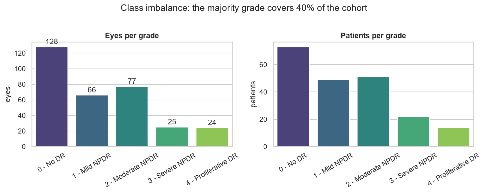
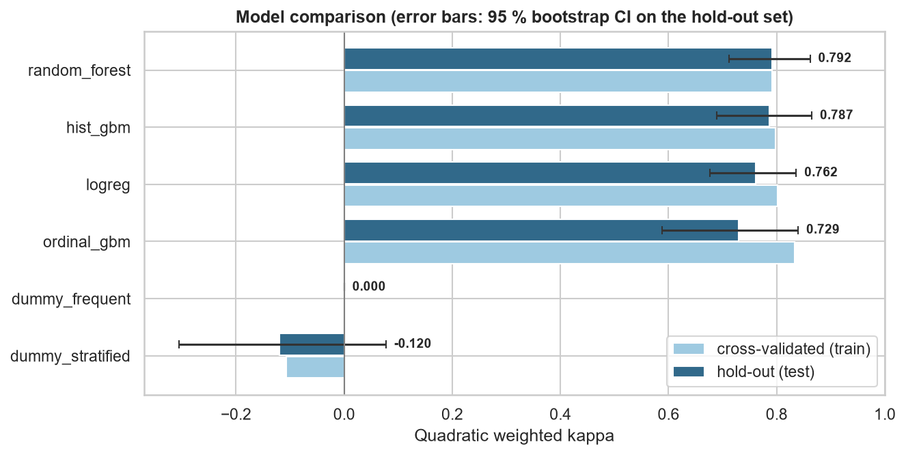
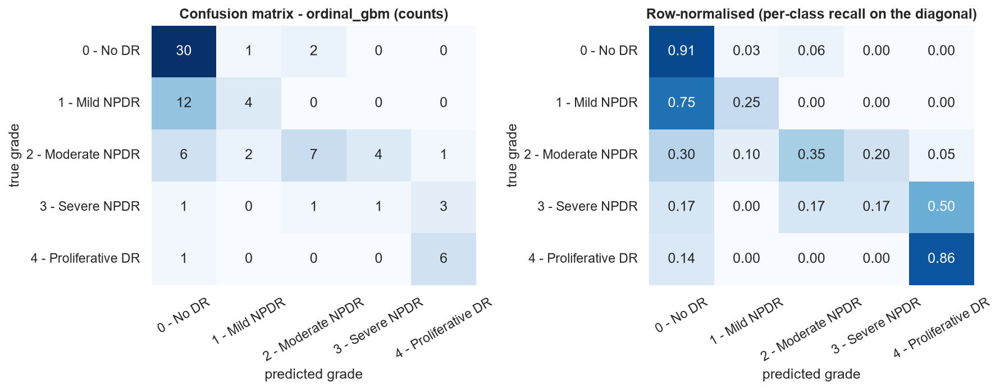
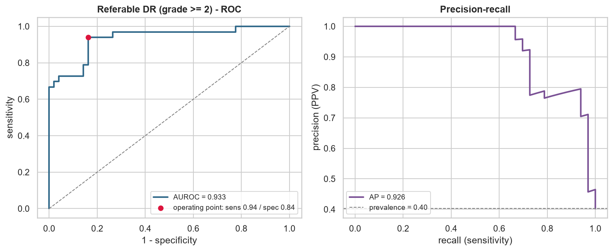
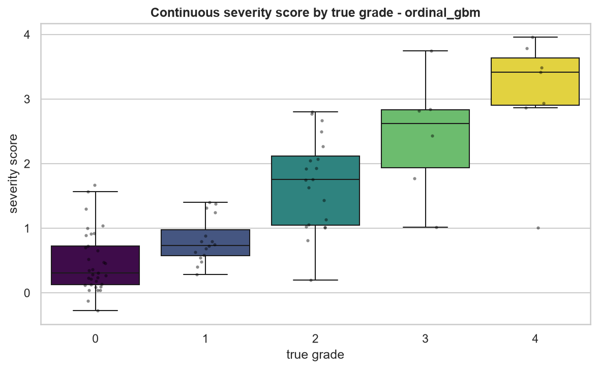
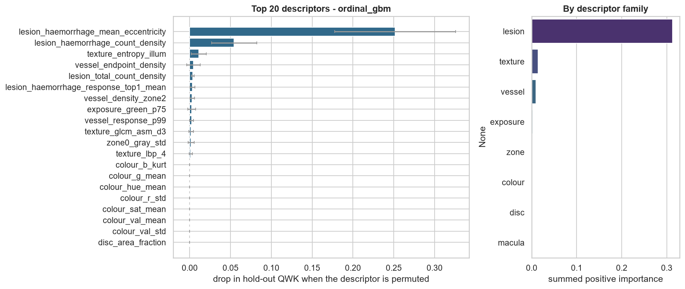
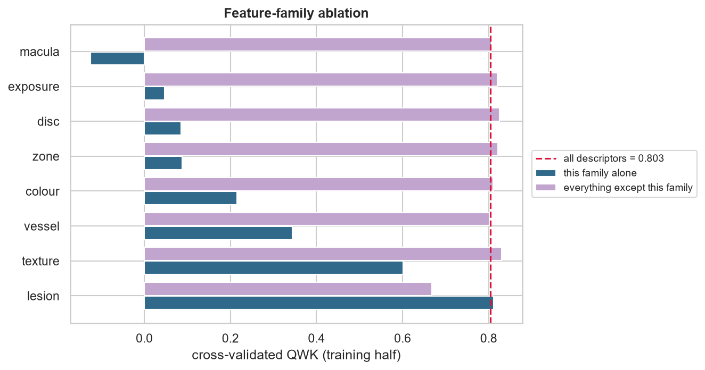
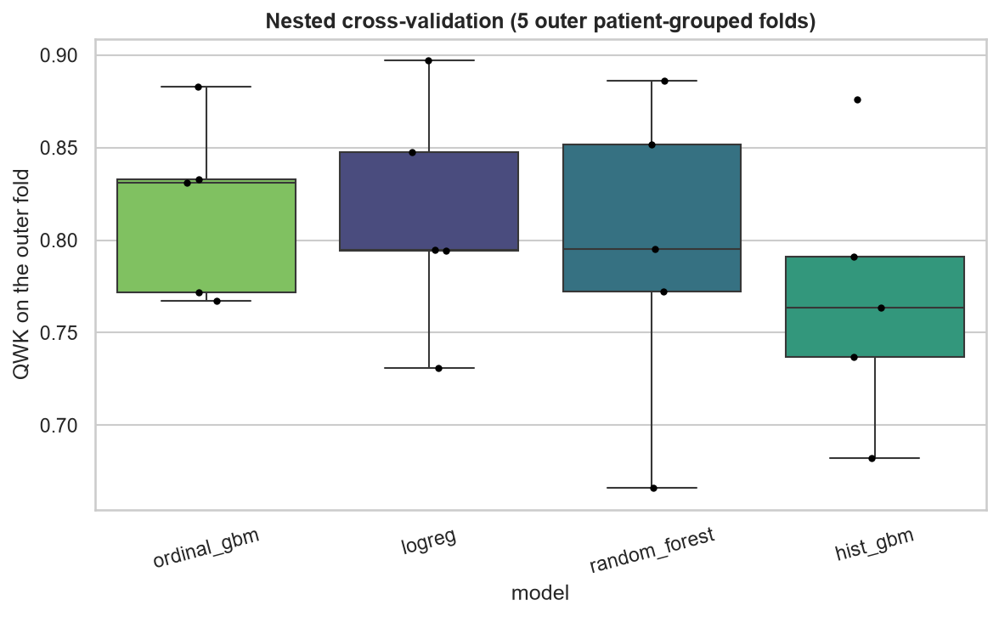
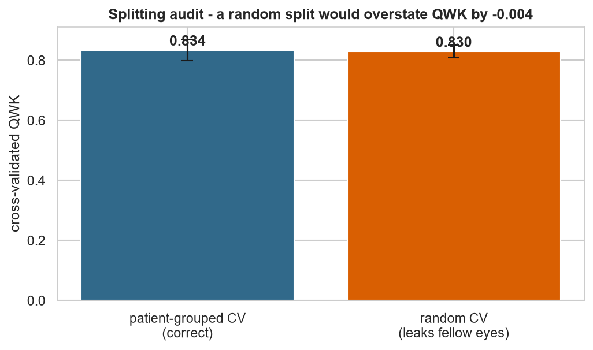
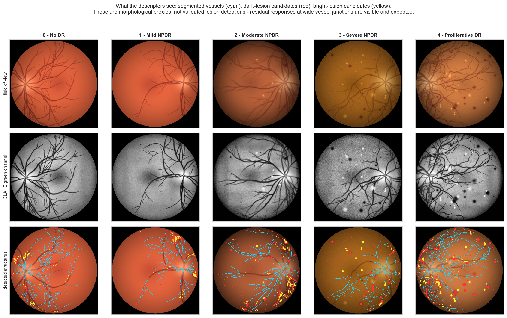

# Diabetic retinopathy grading - results

_Generated 2026-09-04 23:11:15 · 320 eyes · 160 patients · 144 handcrafted descriptors · scikit-learn 1.9.0_

## 1. Headline

The selected model is **ordinal_gbm** — Gradient-boosted regression on the grade plus QWK-optimal cut points (ordinal-aware).

* Quadratic weighted kappa on the untouched hold-out set: **0.729** (95 % CI 0.588 - 0.840).
* Majority-class baseline: 0.000 QWK, 0.200 balanced accuracy.
* Paired bootstrap against that baseline: Δ QWK = +0.729 [+0.557, +0.844], p = 0.0000.
* Referable disease (grade ≥ 2): AUROC 0.933, specificity 0.837 at 0.939 sensitivity.

## 2. Cohort and splitting

| grade | name | eyes | share |
| --- | --- | ---: | ---: |
| 0 | No DR | 128 | 40.0% |
| 1 | Mild NPDR | 66 | 20.6% |
| 2 | Moderate NPDR | 77 | 24.1% |
| 3 | Severe NPDR | 25 | 7.8% |
| 4 | Proliferative DR | 24 | 7.5% |

The hold-out set contains **82 eyes from 41 patients**, disjoint from the 238 training eyes (119 patients). Splitting is stratified on the grade *and* grouped by patient, so no fellow eye is ever seen on both sides.

**The size of that effect is measured, not assumed:** cross-validating the same model with a naive random split gives QWK 0.830 versus 0.834 with patient-grouped folds - a difference of only -0.004. Patient identity carries little information on this particular cohort; the audit is a measurement rather than an assumption, and on a cohort where both eyes come from one camera session it typically finds a large positive gap (figure 09).

## 3. Model comparison

| model | CV QWK (train) | hold-out QWK [95 % CI] | balanced acc. | macro F1 | accuracy | mean grade error |
| --- | ---: | ---: | ---: | ---: | ---: | ---: |
| random_forest | 0.792 ± 0.044 | 0.792 [0.712, 0.862] | 0.544 | 0.533 | 0.634 | 0.49 |
| hist_gbm | 0.797 ± 0.041 | 0.787 [0.690, 0.865] | 0.571 | 0.561 | 0.622 | 0.49 |
| logreg | 0.802 ± 0.032 | 0.762 [0.676, 0.836] | 0.480 | 0.454 | 0.500 | 0.61 |
| **ordinal_gbm** ★ | 0.833 ± 0.041 | 0.729 [0.588, 0.840] | 0.507 | 0.485 | 0.585 | 0.59 |
| dummy_frequent | 0.000 ± 0.000 | 0.000 [0.000, 0.000] | 0.200 | 0.115 | 0.402 | 1.24 |
| dummy_stratified | -0.107 ± 0.058 | -0.120 [-0.306, 0.077] | 0.199 | 0.187 | 0.280 | 1.34 |

★ selected model. _Selection rule: highest patient-grouped cross-validated QWK on the training half; the hold-out set was not consulted for selection._

**The selected model is not the top scorer on this particular hold-out draw** (`random_forest` reaches 0.792 against 0.729). The confidence intervals overlap, and the paired bootstrap against the cross-validation runner-up (`logreg`) is inconclusive (Δ = -0.033, p = 0.71) - which is what selection noise on 82 test eyes looks like. The nested cross-validation below is the estimate to trust for ranking, because it is not contaminated by selection.

### Nested cross-validation

Tuning and fitting were repeated inside 5 outer patient-grouped folds, so the numbers below contain no model-selection optimism.

| model | nested QWK | spread over folds |
| --- | ---: | ---: |
| ordinal_gbm | 0.817 | ± 0.043 |
| logreg | 0.813 | ± 0.056 |
| random_forest | 0.794 | ± 0.076 |
| hist_gbm | 0.770 | ± 0.064 |

## 4. What the model actually uses

Permutation importance is measured on the **hold-out** set with QWK as the score, so it reports the loss in real predictive performance when a descriptor is destroyed - not the training-set impurity heuristic.

| descriptor | family | Δ QWK when permuted | meaning |
| --- | --- | ---: | --- |
| `lesion_haemorrhage_mean_eccentricity` | lesion | 0.2518 | Elongation of the dark blobs; round blobs indicate true lesions rather than vessel remnants. |
| `lesion_haemorrhage_count_density` | lesion | 0.0544 | Blot-sized dark lesions per 10 000 searched pixels. |
| `texture_entropy_illum` | texture | 0.0112 | GLCM / LBP / entropy statistics of the retinal surface. |
| `vessel_endpoint_density` | vessel | 0.0046 | Skeleton endpoints per unit length (fragmentation / drop-out). |
| `lesion_total_count_density` | lesion | 0.0036 | Total lesion count density across all four lesion types. |
| `lesion_haemorrhage_response_top1_mean` | lesion | 0.0033 | Diabetic lesions: microaneurysms, haemorrhages, hard exudates, cotton-wool spots. |
| `vessel_density_zone2` | vessel | 0.0030 | Vascular tree: Frangi vesselness, calibre, density per zone, branching, fractal dimension. |
| `exposure_green_p75` | exposure | 0.0026 | Acquisition quality: dynamic range, contrast, sharpness, over/under-exposure. |
| `vessel_response_p99` | vessel | 0.0023 | Vascular tree: Frangi vesselness, calibre, density per zone, branching, fractal dimension. |
| `texture_glcm_asm_d3` | texture | 0.0017 | GLCM / LBP / entropy statistics of the retinal surface. |
| `zone0_gray_std` | zone | 0.0017 | Centre-to-periphery intensity profile of the fundus. |
| `texture_lbp_4` | texture | 0.0011 | GLCM / LBP / entropy statistics of the retinal surface. |

### Feature-family ablation

| family | descriptors | QWK using only this family | QWK without it | Δ when removed |
| --- | ---: | ---: | ---: | ---: |
| lesion | 50 | 0.811 | 0.668 | -0.135 |
| texture | 26 | 0.601 | 0.830 | +0.027 |
| vessel | 15 | 0.344 | 0.802 | -0.002 |
| colour | 21 | 0.215 | 0.810 | +0.006 |
| zone | 10 | 0.088 | 0.821 | +0.017 |
| disc | 4 | 0.085 | 0.825 | +0.022 |
| exposure | 16 | 0.047 | 0.820 | +0.017 |
| macula | 2 | -0.125 | 0.807 | +0.004 |

## 5. Figures

## 6. Limitations

* The descriptors are *proxies*: a "microaneurysm count" is the number of small dark top-hat responses, not a lesion validated by an ophthalmologist.
* Quality control is heuristic (field-of-view size, Laplacian focus, exposure); it removes obviously ungradable frames, not subtly degraded ones.
* The hold-out set is a single split of a single cohort. External validation on a different camera and population is the only thing that establishes transportability.
* Nothing here is a medical device. The referral threshold is tuned for 90% sensitivity on this cohort's prevalence and would have to be re-derived for any real screening programme.
