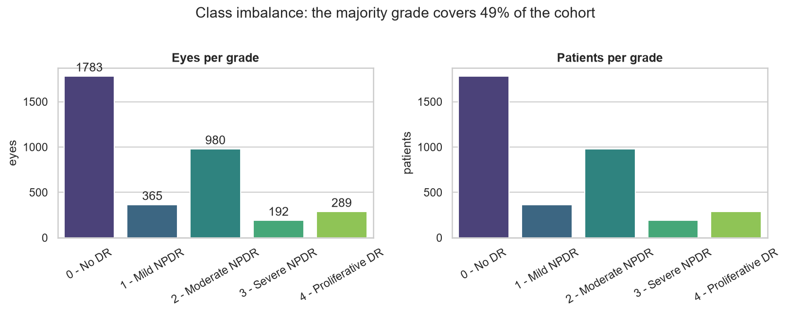
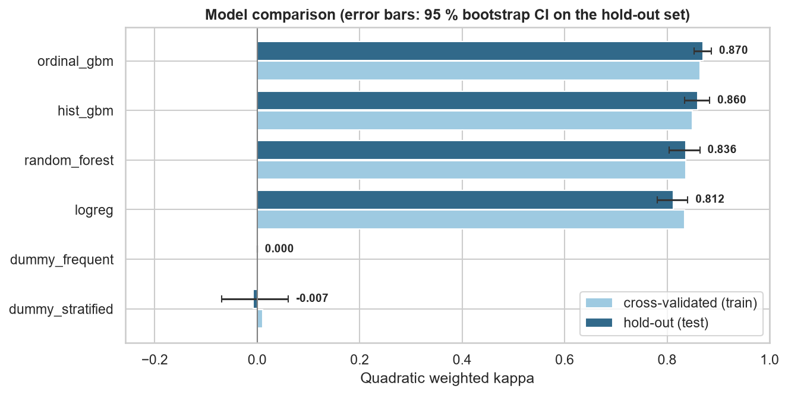
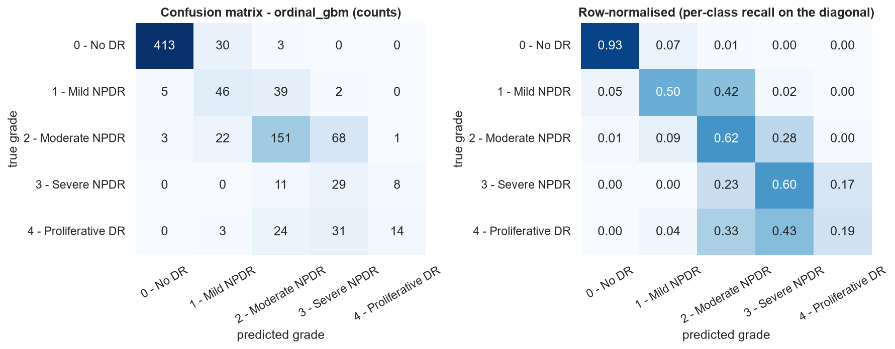
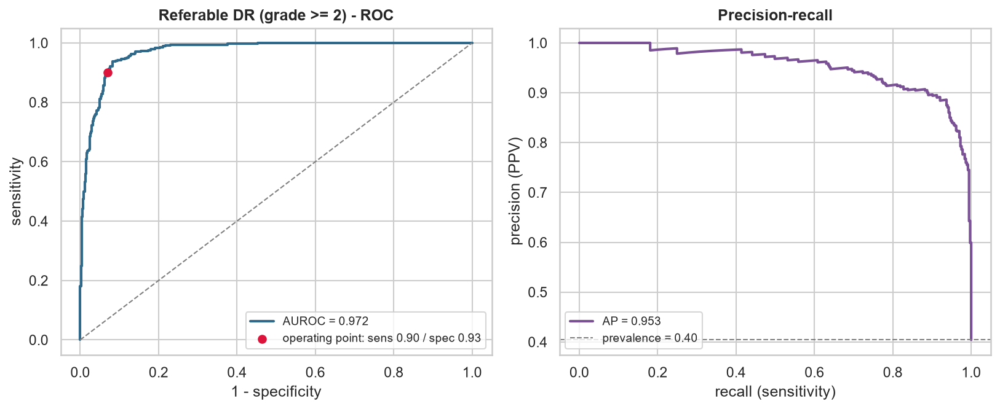
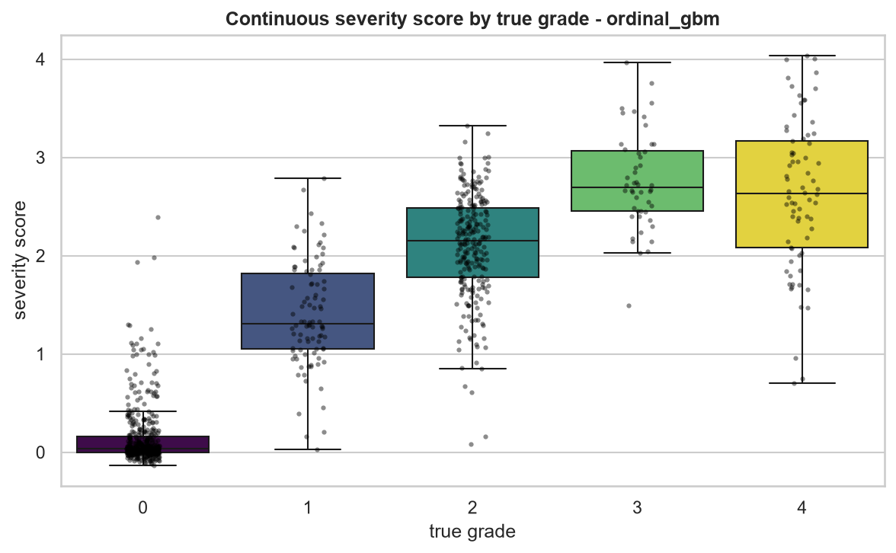
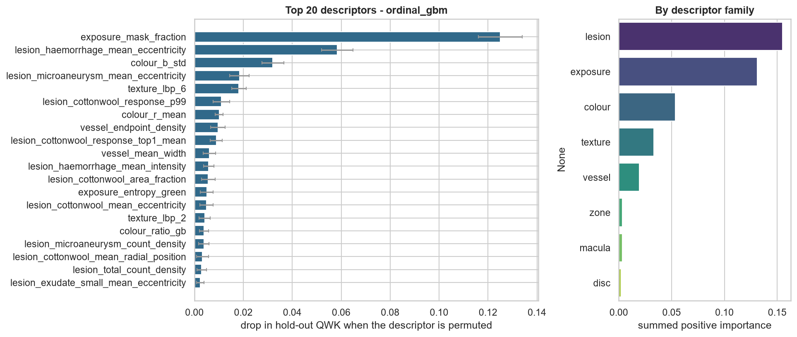
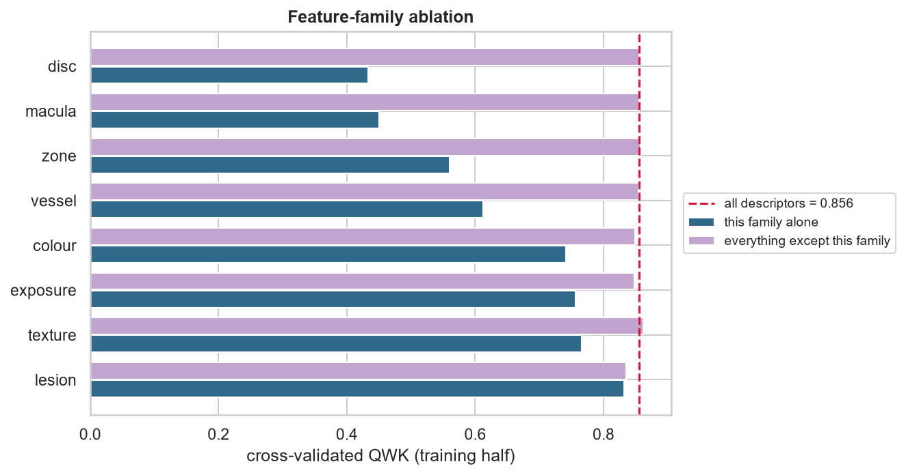
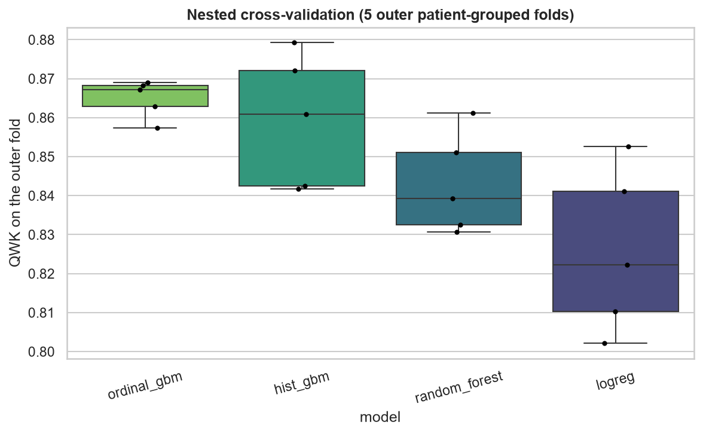
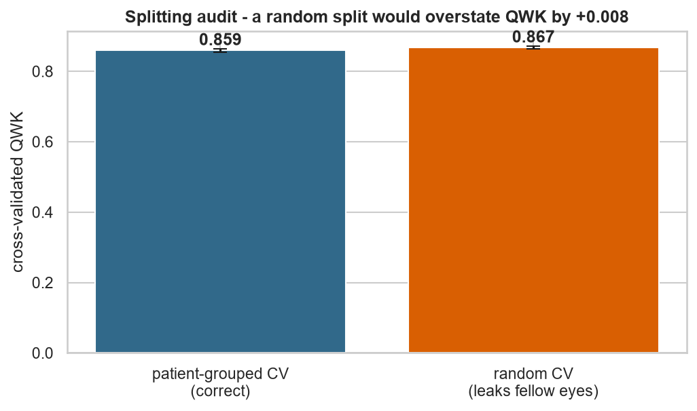
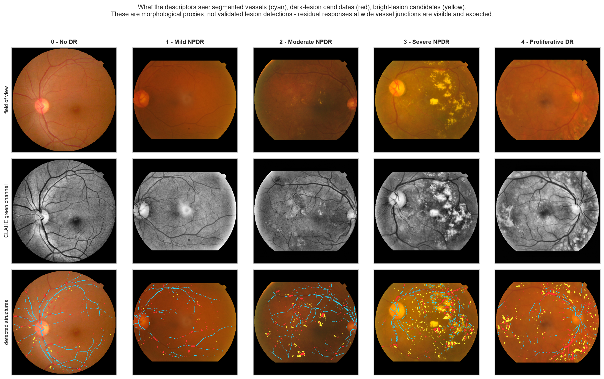

# Diabetic retinopathy grading - results

_Generated 2026-09-06 16:09:15 · 3609 eyes · 3609 patients · 144 handcrafted descriptors · scikit-learn 1.9.0_

## 1. Headline

The selected model is **ordinal_gbm** — Gradient-boosted regression on the grade plus QWK-optimal cut points (ordinal-aware).

* Quadratic weighted kappa on the untouched hold-out set: **0.870** (95 % CI 0.852 - 0.886).
* Majority-class baseline: 0.000 QWK, 0.200 balanced accuracy.
* Paired bootstrap against that baseline: Δ QWK = +0.870 [+0.852, +0.888], p = 0.0000.
* Referable disease (grade ≥ 2): AUROC 0.972, specificity 0.929 at 0.901 sensitivity.

## 2. Cohort and splitting

| grade | name | eyes | share |
| --- | --- | ---: | ---: |
| 0 | No DR | 1783 | 49.4% |
| 1 | Mild NPDR | 365 | 10.1% |
| 2 | Moderate NPDR | 980 | 27.2% |
| 3 | Severe NPDR | 192 | 5.3% |
| 4 | Proliferative DR | 289 | 8.0% |

The hold-out set contains **903 eyes from 903 patients**, disjoint from the 2706 training eyes (2706 patients). Splitting is stratified on the grade *and* grouped by patient, so no fellow eye is ever seen on both sides.

**The size of that effect is measured, not assumed:** cross-validating the same model with a naive random split gives QWK 0.867 versus 0.859 with patient-grouped folds - a difference of only +0.008. Patient identity carries little information on this particular cohort; the audit is a measurement rather than an assumption, and on a cohort where both eyes come from one camera session it typically finds a large positive gap (figure 09).

## 3. Model comparison

| model | CV QWK (train) | hold-out QWK [95 % CI] | balanced acc. | macro F1 | accuracy | mean grade error |
| --- | ---: | ---: | ---: | ---: | ---: | ---: |
| **ordinal_gbm** ★ | 0.864 ± 0.005 | 0.870 [0.852, 0.886] | 0.568 | 0.538 | 0.723 | 0.32 |
| hist_gbm | 0.849 ± 0.018 | 0.860 [0.835, 0.883] | 0.645 | 0.660 | 0.819 | 0.26 |
| random_forest | 0.836 ± 0.023 | 0.836 [0.804, 0.864] | 0.623 | 0.627 | 0.800 | 0.29 |
| logreg | 0.834 ± 0.016 | 0.812 [0.781, 0.840] | 0.625 | 0.572 | 0.725 | 0.39 |
| dummy_frequent | 0.000 ± 0.000 | 0.000 [0.000, 0.000] | 0.200 | 0.132 | 0.494 | 1.12 |
| dummy_stratified | 0.011 ± 0.039 | -0.007 [-0.069, 0.061] | 0.199 | 0.198 | 0.346 | 1.34 |

★ selected model. _Selection rule: highest patient-grouped cross-validated QWK on the training half; the hold-out set was not consulted for selection._

### Nested cross-validation

Tuning and fitting were repeated inside 5 outer patient-grouped folds, so the numbers below contain no model-selection optimism.

| model | nested QWK | spread over folds |
| --- | ---: | ---: |
| ordinal_gbm | 0.865 | ± 0.004 |
| hist_gbm | 0.859 | ± 0.015 |
| random_forest | 0.843 | ± 0.012 |
| logreg | 0.826 | ± 0.019 |

## 4. What the model actually uses

Permutation importance is measured on the **hold-out** set with QWK as the score, so it reports the loss in real predictive performance when a descriptor is destroyed - not the training-set impurity heuristic.

| descriptor | family | Δ QWK when permuted | meaning |
| --- | --- | ---: | --- |
| `exposure_mask_fraction` | exposure | 0.1250 | Acquisition quality: dynamic range, contrast, sharpness, over/under-exposure. |
| `lesion_haemorrhage_mean_eccentricity` | lesion | 0.0584 | Elongation of the dark blobs; round blobs indicate true lesions rather than vessel remnants. |
| `colour_b_std` | colour | 0.0320 | Pigmentation and white balance of the retinal background (RGB/HSV moments and ratios). |
| `lesion_microaneurysm_mean_eccentricity` | lesion | 0.0184 | Diabetic lesions: microaneurysms, haemorrhages, hard exudates, cotton-wool spots. |
| `texture_lbp_6` | texture | 0.0182 | GLCM / LBP / entropy statistics of the retinal surface. |
| `lesion_cottonwool_response_p99` | lesion | 0.0110 | Diabetic lesions: microaneurysms, haemorrhages, hard exudates, cotton-wool spots. |
| `colour_r_mean` | colour | 0.0101 | Pigmentation and white balance of the retinal background (RGB/HSV moments and ratios). |
| `vessel_endpoint_density` | vessel | 0.0096 | Skeleton endpoints per unit length (fragmentation / drop-out). |
| `lesion_cottonwool_response_top1_mean` | lesion | 0.0089 | Diabetic lesions: microaneurysms, haemorrhages, hard exudates, cotton-wool spots. |
| `vessel_mean_width` | vessel | 0.0062 | Mean vessel calibre = vessel area / skeleton length. |
| `lesion_haemorrhage_mean_intensity` | lesion | 0.0058 | Diabetic lesions: microaneurysms, haemorrhages, hard exudates, cotton-wool spots. |
| `lesion_cottonwool_area_fraction` | lesion | 0.0057 | Diabetic lesions: microaneurysms, haemorrhages, hard exudates, cotton-wool spots. |

### Feature-family ablation

| family | descriptors | QWK using only this family | QWK without it | Δ when removed |
| --- | ---: | ---: | ---: | ---: |
| lesion | 50 | 0.832 | 0.835 | -0.020 |
| texture | 26 | 0.766 | 0.862 | +0.006 |
| exposure | 16 | 0.756 | 0.848 | -0.008 |
| colour | 21 | 0.741 | 0.849 | -0.006 |
| vessel | 15 | 0.612 | 0.854 | -0.002 |
| zone | 10 | 0.560 | 0.857 | +0.001 |
| macula | 2 | 0.450 | 0.856 | -0.000 |
| disc | 4 | 0.433 | 0.855 | -0.000 |

## 5. Figures

## 6. Limitations

* The descriptors are *proxies*: a "microaneurysm count" is the number of small dark top-hat responses, not a lesion validated by an ophthalmologist.
* Quality control is heuristic (field-of-view size, Laplacian focus, exposure); it removes obviously ungradable frames, not subtly degraded ones.
* The hold-out set is a single split of a single cohort. External validation on a different camera and population is the only thing that establishes transportability.
* Nothing here is a medical device. The referral threshold is tuned for 90% sensitivity on this cohort's prevalence and would have to be re-derived for any real screening programme.
