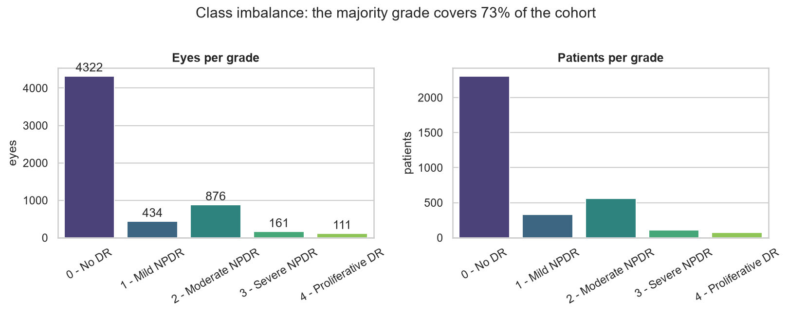
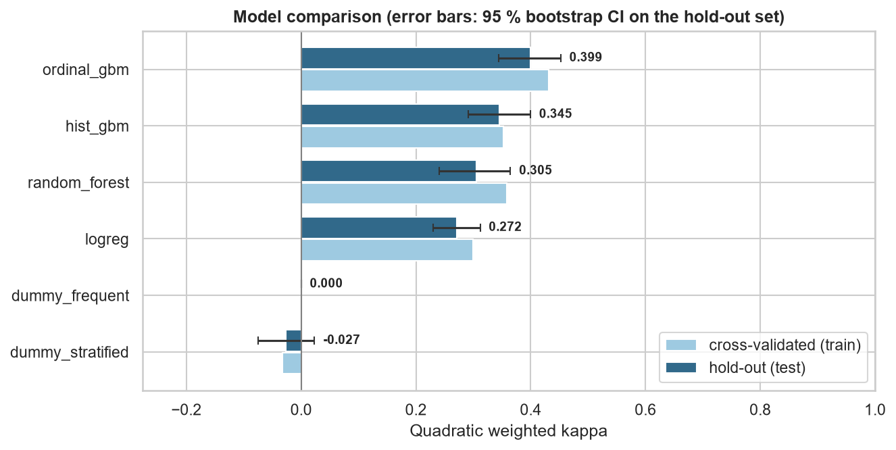
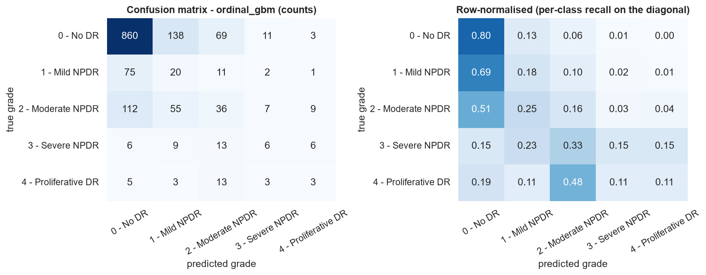
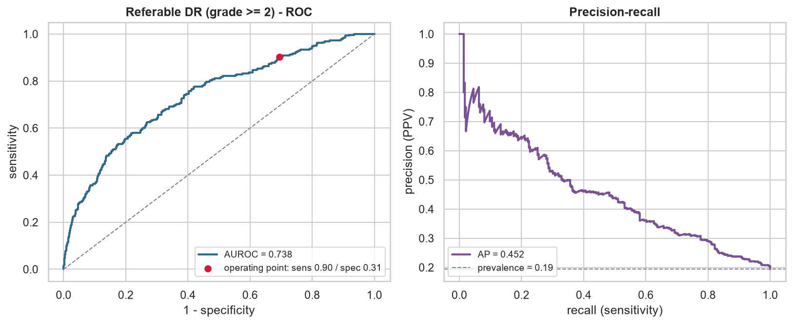
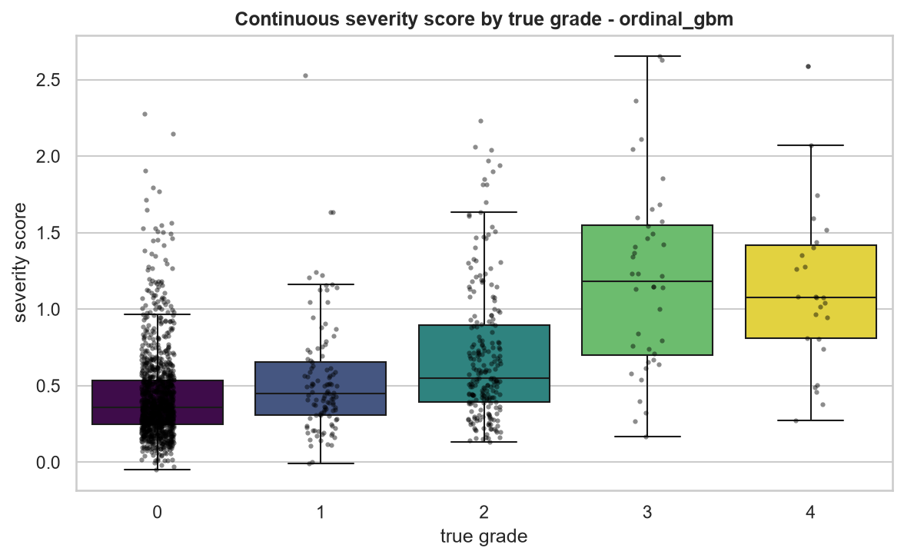
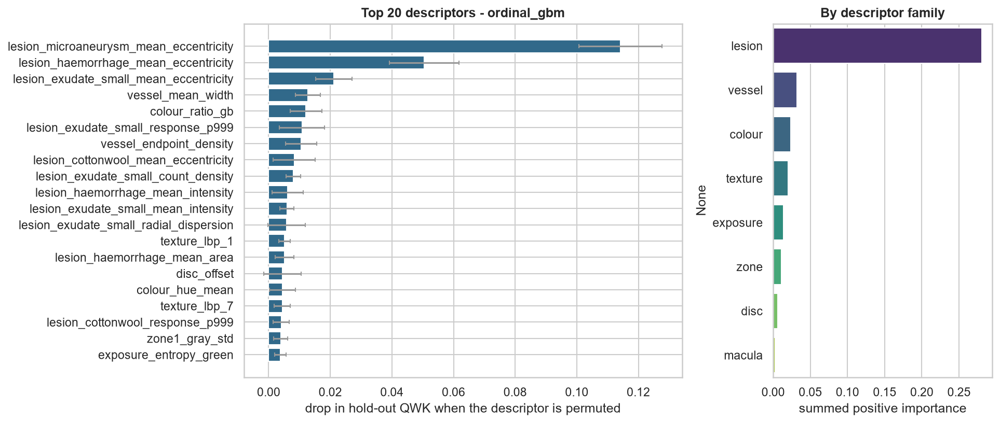
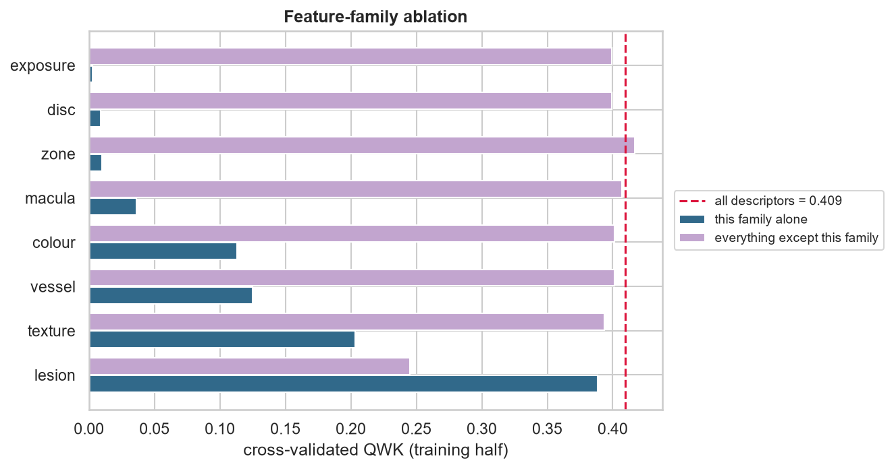
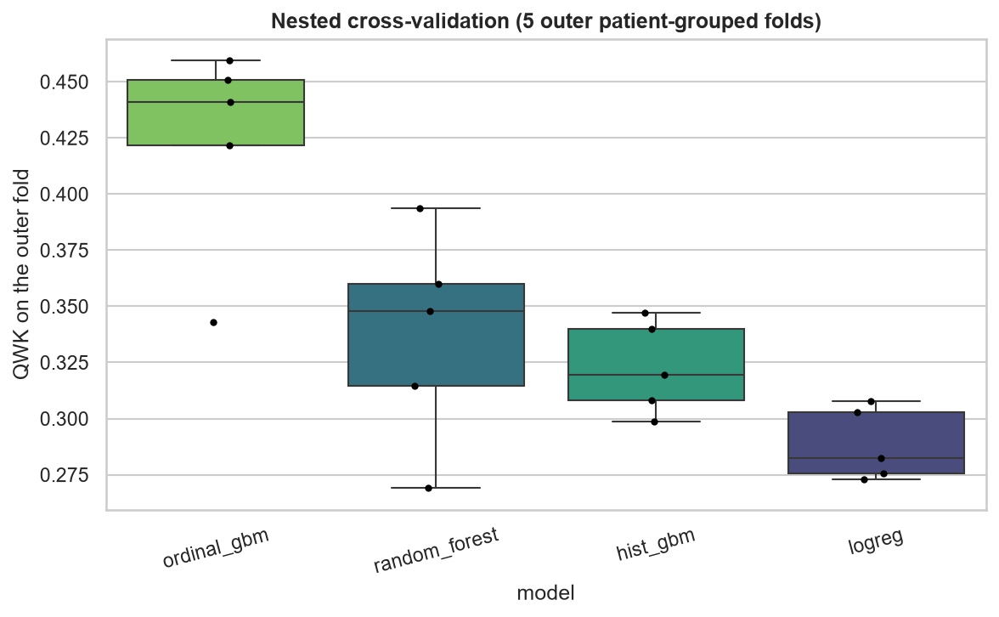
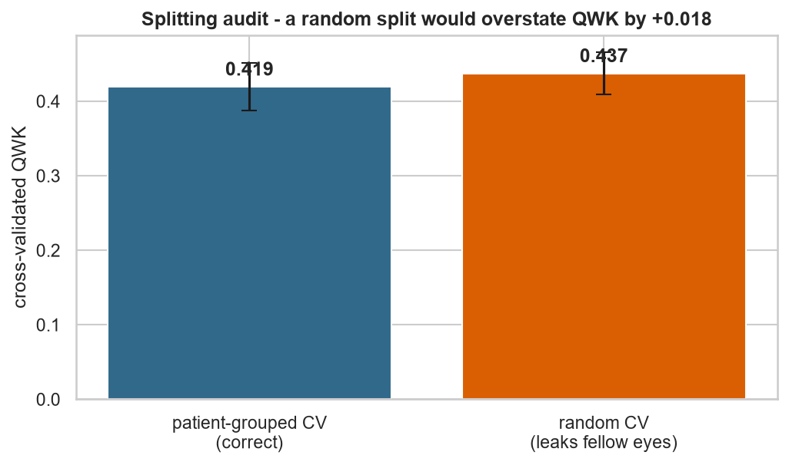
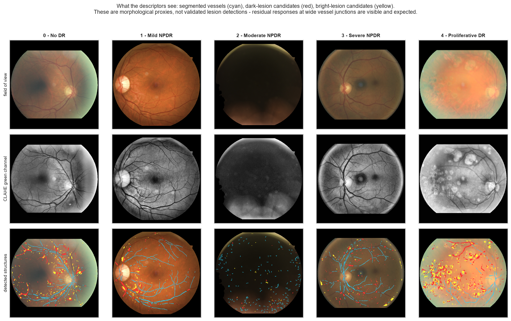

# Diabetic retinopathy grading - results

_Generated 2026-09-06 07:47:57 · 5904 eyes · 2984 patients · 144 handcrafted descriptors · scikit-learn 1.9.0_

## 1. Headline

The selected model is **ordinal_gbm** — Gradient-boosted regression on the grade plus QWK-optimal cut points (ordinal-aware).

* Quadratic weighted kappa on the untouched hold-out set: **0.399** (95 % CI 0.344 - 0.452).
* Majority-class baseline: 0.000 QWK, 0.200 balanced accuracy.
* Paired bootstrap against that baseline: Δ QWK = +0.399 [+0.339, +0.458], p = 0.0000.
* Referable disease (grade ≥ 2): AUROC 0.738, specificity 0.305 at 0.902 sensitivity.

## 2. Cohort and splitting

| grade | name | eyes | share |
| --- | --- | ---: | ---: |
| 0 | No DR | 4322 | 73.2% |
| 1 | Mild NPDR | 434 | 7.4% |
| 2 | Moderate NPDR | 876 | 14.8% |
| 3 | Severe NPDR | 161 | 2.7% |
| 4 | Proliferative DR | 111 | 1.9% |

The hold-out set contains **1476 eyes from 746 patients**, disjoint from the 4428 training eyes (2238 patients). Splitting is stratified on the grade *and* grouped by patient, so no fellow eye is ever seen on both sides.

**The size of that effect is measured, not assumed:** cross-validating the same model with a naive random split gives QWK 0.437 versus 0.419 with patient-grouped folds - an optimism of +0.018 that a naive protocol would have reported as real performance (figure 09).

## 3. Model comparison

| model | CV QWK (train) | hold-out QWK [95 % CI] | balanced acc. | macro F1 | accuracy | mean grade error |
| --- | ---: | ---: | ---: | ---: | ---: | ---: |
| **ordinal_gbm** ★ | 0.431 ± 0.031 | 0.399 [0.344, 0.452] | 0.281 | 0.284 | 0.627 | 0.56 |
| hist_gbm | 0.353 ± 0.021 | 0.345 [0.291, 0.400] | 0.309 | 0.311 | 0.632 | 0.62 |
| random_forest | 0.358 ± 0.018 | 0.305 [0.240, 0.365] | 0.287 | 0.291 | 0.701 | 0.56 |
| logreg | 0.299 ± 0.010 | 0.272 [0.230, 0.312] | 0.353 | 0.266 | 0.411 | 0.96 |
| dummy_frequent | 0.000 ± 0.000 | 0.000 [0.000, 0.000] | 0.200 | 0.169 | 0.732 | 0.53 |
| dummy_stratified | -0.033 ± 0.028 | -0.027 [-0.075, 0.023] | 0.190 | 0.190 | 0.546 | 0.87 |

★ selected model. _Selection rule: highest patient-grouped cross-validated QWK on the training half; the hold-out set was not consulted for selection._

### Nested cross-validation

Tuning and fitting were repeated inside 5 outer patient-grouped folds, so the numbers below contain no model-selection optimism.

| model | nested QWK | spread over folds |
| --- | ---: | ---: |
| ordinal_gbm | 0.423 | ± 0.042 |
| random_forest | 0.337 | ± 0.042 |
| hist_gbm | 0.323 | ± 0.018 |
| logreg | 0.288 | ± 0.014 |

## 4. What the model actually uses

Permutation importance is measured on the **hold-out** set with QWK as the score, so it reports the loss in real predictive performance when a descriptor is destroyed - not the training-set impurity heuristic.

| descriptor | family | Δ QWK when permuted | meaning |
| --- | --- | ---: | --- |
| `lesion_microaneurysm_mean_eccentricity` | lesion | 0.1142 | Diabetic lesions: microaneurysms, haemorrhages, hard exudates, cotton-wool spots. |
| `lesion_haemorrhage_mean_eccentricity` | lesion | 0.0505 | Elongation of the dark blobs; round blobs indicate true lesions rather than vessel remnants. |
| `lesion_exudate_small_mean_eccentricity` | lesion | 0.0212 | Diabetic lesions: microaneurysms, haemorrhages, hard exudates, cotton-wool spots. |
| `vessel_mean_width` | vessel | 0.0127 | Mean vessel calibre = vessel area / skeleton length. |
| `colour_ratio_gb` | colour | 0.0121 | Pigmentation and white balance of the retinal background (RGB/HSV moments and ratios). |
| `lesion_exudate_small_response_p999` | lesion | 0.0109 | Diabetic lesions: microaneurysms, haemorrhages, hard exudates, cotton-wool spots. |
| `vessel_endpoint_density` | vessel | 0.0106 | Skeleton endpoints per unit length (fragmentation / drop-out). |
| `lesion_cottonwool_mean_eccentricity` | lesion | 0.0083 | Diabetic lesions: microaneurysms, haemorrhages, hard exudates, cotton-wool spots. |
| `lesion_exudate_small_count_density` | lesion | 0.0080 | Punctate bright lesions (hard exudates) per 10 000 px. |
| `lesion_haemorrhage_mean_intensity` | lesion | 0.0062 | Diabetic lesions: microaneurysms, haemorrhages, hard exudates, cotton-wool spots. |
| `lesion_exudate_small_mean_intensity` | lesion | 0.0060 | Diabetic lesions: microaneurysms, haemorrhages, hard exudates, cotton-wool spots. |
| `lesion_exudate_small_radial_dispersion` | lesion | 0.0058 | Diabetic lesions: microaneurysms, haemorrhages, hard exudates, cotton-wool spots. |

### Feature-family ablation

| family | descriptors | QWK using only this family | QWK without it | Δ when removed |
| --- | ---: | ---: | ---: | ---: |
| lesion | 50 | 0.388 | 0.245 | -0.164 |
| texture | 26 | 0.203 | 0.393 | -0.016 |
| vessel | 15 | 0.125 | 0.401 | -0.008 |
| colour | 21 | 0.113 | 0.402 | -0.008 |
| macula | 2 | 0.036 | 0.407 | -0.003 |
| zone | 10 | 0.010 | 0.417 | +0.008 |
| disc | 4 | 0.009 | 0.399 | -0.010 |
| exposure | 16 | 0.003 | 0.399 | -0.010 |

## 5. Figures

## 6. Limitations

* The descriptors are *proxies*: a "microaneurysm count" is the number of small dark top-hat responses, not a lesion validated by an ophthalmologist.
* Quality control is heuristic (field-of-view size, Laplacian focus, exposure); it removes obviously ungradable frames, not subtly degraded ones.
* The hold-out set is a single split of a single cohort. External validation on a different camera and population is the only thing that establishes transportability.
* Nothing here is a medical device. The referral threshold is tuned for 90% sensitivity on this cohort's prevalence and would have to be re-derived for any real screening programme.
