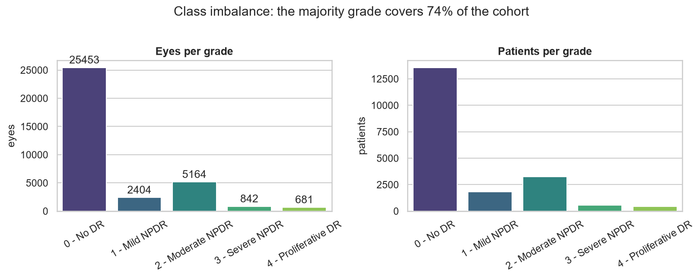
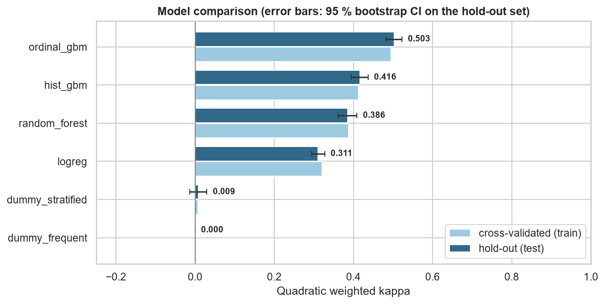
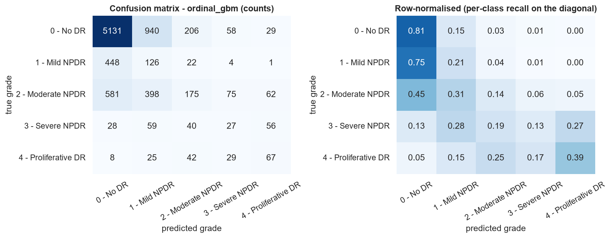
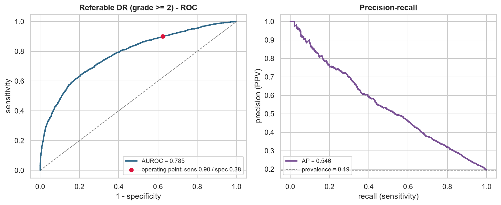
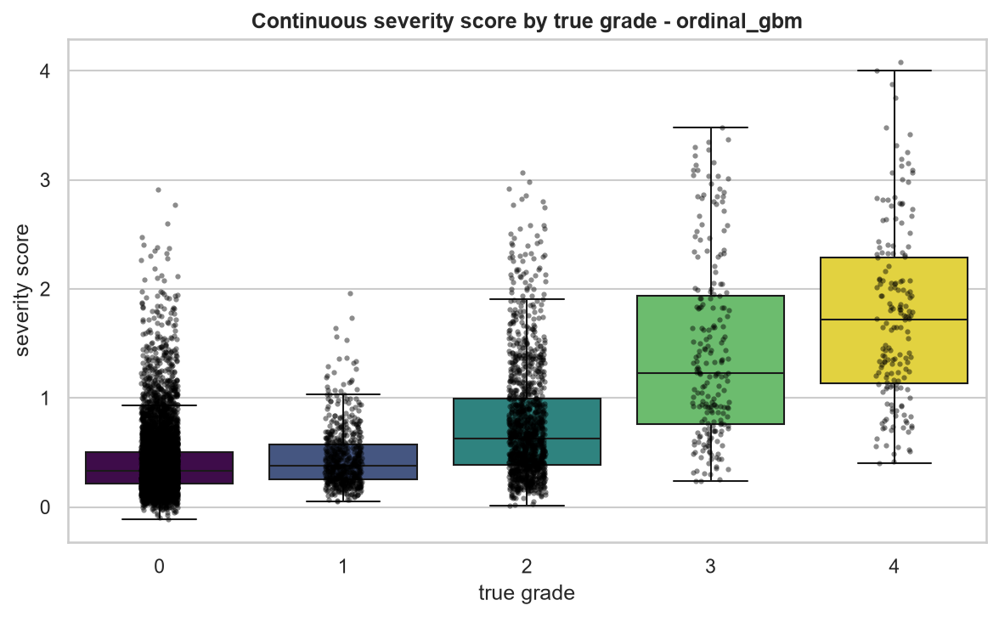
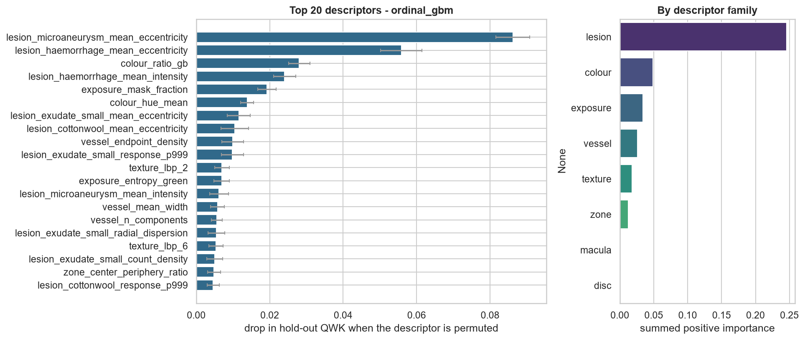
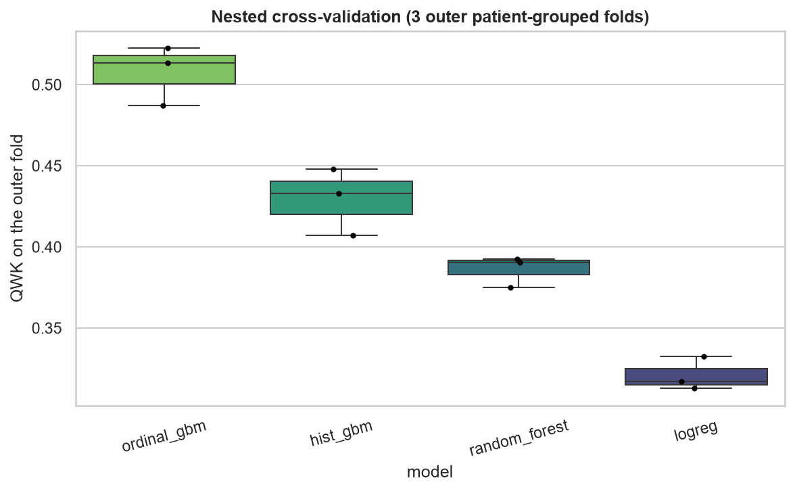
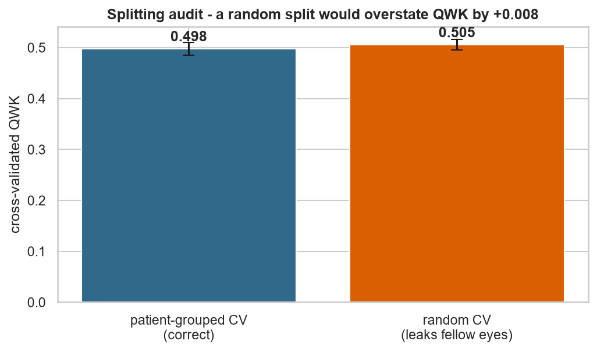

# Diabetic retinopathy grading - results

_Generated 2026-09-06 13:41:53 · 34544 eyes · 17459 patients · 144 handcrafted descriptors · scikit-learn 1.9.0_

## 1. Headline

The selected model is **ordinal_gbm** — Gradient-boosted regression on the grade plus QWK-optimal cut points (ordinal-aware).

* Quadratic weighted kappa on the untouched hold-out set: **0.503** (95 % CI 0.483 - 0.523).
* Majority-class baseline: 0.000 QWK, 0.200 balanced accuracy.
* Paired bootstrap against that baseline: Δ QWK = +0.503 [+0.476, +0.526], p = 0.0000.
* Referable disease (grade ≥ 2): AUROC 0.785, specificity 0.375 at 0.900 sensitivity.

## 2. Cohort and splitting

| grade | name | eyes | share |
| --- | --- | ---: | ---: |
| 0 | No DR | 25453 | 73.7% |
| 1 | Mild NPDR | 2404 | 7.0% |
| 2 | Moderate NPDR | 5164 | 14.9% |
| 3 | Severe NPDR | 842 | 2.4% |
| 4 | Proliferative DR | 681 | 2.0% |

The hold-out set contains **8637 eyes from 4366 patients**, disjoint from the 25907 training eyes (13093 patients). Splitting is stratified on the grade *and* grouped by patient, so no fellow eye is ever seen on both sides.

**The size of that effect is measured, not assumed:** cross-validating the same model with a naive random split gives QWK 0.505 versus 0.498 with patient-grouped folds - a difference of only +0.008. Patient identity carries little information on this particular cohort; the audit is a measurement rather than an assumption, and on a cohort where both eyes come from one camera session it typically finds a large positive gap (figure 09).

## 3. Model comparison

| model | CV QWK (train) | hold-out QWK [95 % CI] | balanced acc. | macro F1 | accuracy | mean grade error |
| --- | ---: | ---: | ---: | ---: | ---: | ---: |
| **ordinal_gbm** ★ | 0.495 ± 0.012 | 0.503 [0.483, 0.523] | 0.334 | 0.323 | 0.640 | 0.51 |
| hist_gbm | 0.413 ± 0.013 | 0.416 [0.395, 0.437] | 0.389 | 0.378 | 0.636 | 0.60 |
| random_forest | 0.388 ± 0.020 | 0.386 [0.362, 0.409] | 0.386 | 0.354 | 0.715 | 0.54 |
| logreg | 0.321 ± 0.014 | 0.311 [0.294, 0.327] | 0.443 | 0.299 | 0.430 | 0.94 |
| dummy_stratified | 0.007 ± 0.009 | 0.009 [-0.013, 0.030] | 0.210 | 0.210 | 0.577 | 0.81 |
| dummy_frequent | -0.000 ± 0.000 | 0.000 [0.000, 0.000] | 0.200 | 0.170 | 0.737 | 0.52 |

★ selected model. _Selection rule: highest patient-grouped cross-validated QWK on the training half; the hold-out set was not consulted for selection._

### Nested cross-validation

Tuning and fitting were repeated inside 3 outer patient-grouped folds, so the numbers below contain no model-selection optimism.

| model | nested QWK | spread over folds |
| --- | ---: | ---: |
| ordinal_gbm | 0.508 | ± 0.015 |
| hist_gbm | 0.429 | ± 0.017 |
| random_forest | 0.386 | ± 0.008 |
| logreg | 0.321 | ± 0.008 |

## 4. What the model actually uses

Permutation importance is measured on the **hold-out** set with QWK as the score, so it reports the loss in real predictive performance when a descriptor is destroyed - not the training-set impurity heuristic.

| descriptor | family | Δ QWK when permuted | meaning |
| --- | --- | ---: | --- |
| `lesion_microaneurysm_mean_eccentricity` | lesion | 0.0862 | Diabetic lesions: microaneurysms, haemorrhages, hard exudates, cotton-wool spots. |
| `lesion_haemorrhage_mean_eccentricity` | lesion | 0.0558 | Elongation of the dark blobs; round blobs indicate true lesions rather than vessel remnants. |
| `colour_ratio_gb` | colour | 0.0280 | Pigmentation and white balance of the retinal background (RGB/HSV moments and ratios). |
| `lesion_haemorrhage_mean_intensity` | lesion | 0.0241 | Diabetic lesions: microaneurysms, haemorrhages, hard exudates, cotton-wool spots. |
| `exposure_mask_fraction` | exposure | 0.0192 | Acquisition quality: dynamic range, contrast, sharpness, over/under-exposure. |
| `colour_hue_mean` | colour | 0.0138 | Pigmentation and white balance of the retinal background (RGB/HSV moments and ratios). |
| `lesion_exudate_small_mean_eccentricity` | lesion | 0.0116 | Diabetic lesions: microaneurysms, haemorrhages, hard exudates, cotton-wool spots. |
| `lesion_cottonwool_mean_eccentricity` | lesion | 0.0105 | Diabetic lesions: microaneurysms, haemorrhages, hard exudates, cotton-wool spots. |
| `vessel_endpoint_density` | vessel | 0.0099 | Skeleton endpoints per unit length (fragmentation / drop-out). |
| `lesion_exudate_small_response_p999` | lesion | 0.0098 | Diabetic lesions: microaneurysms, haemorrhages, hard exudates, cotton-wool spots. |
| `texture_lbp_2` | texture | 0.0070 | GLCM / LBP / entropy statistics of the retinal surface. |
| `exposure_entropy_green` | exposure | 0.0069 | Acquisition quality: dynamic range, contrast, sharpness, over/under-exposure. |

### Feature-family ablation

| family | descriptors | QWK using only this family | QWK without it | Δ when removed |
| --- | ---: | ---: | ---: | ---: |
| lesion | 50 | 0.445 | 0.367 | -0.118 |
| texture | 26 | 0.261 | 0.487 | +0.002 |
| vessel | 15 | 0.202 | 0.485 | +0.000 |
| colour | 21 | 0.173 | 0.475 | -0.010 |
| exposure | 16 | 0.124 | 0.479 | -0.006 |
| zone | 10 | 0.069 | 0.486 | +0.002 |
| disc | 4 | 0.054 | 0.485 | -0.000 |
| macula | 2 | 0.016 | 0.485 | -0.000 |

## 5. Figures

## 6. Limitations

* The descriptors are *proxies*: a "microaneurysm count" is the number of small dark top-hat responses, not a lesion validated by an ophthalmologist.
* Quality control is heuristic (field-of-view size, Laplacian focus, exposure); it removes obviously ungradable frames, not subtly degraded ones.
* The hold-out set is a single split of a single cohort. External validation on a different camera and population is the only thing that establishes transportability.
* Nothing here is a medical device. The referral threshold is tuned for 90% sensitivity on this cohort's prevalence and would have to be re-derived for any real screening programme.
